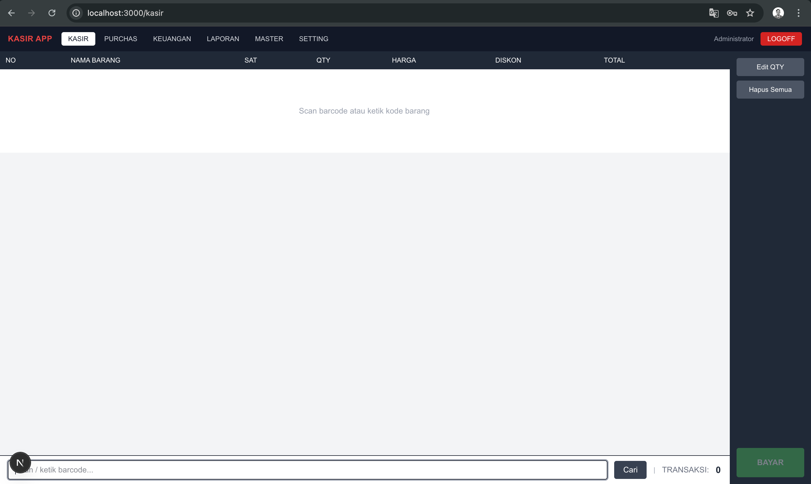

# Cashier App — Renal

A web-based Point of Sale (POS) system for retail stores. Runs offline-first on localhost, accessible from any device on the same local network — cashier on PC, owner checks analytics on phone or laptop.

---

---

## Tech Stack

| Layer | Tech |
|---|---|
| Frontend | Next.js 15 (App Router) + TypeScript + Tailwind CSS + Recharts |
| Backend | Python FastAPI + Pydantic v2 |
| ORM | SQLAlchemy 2 + Alembic |
| Database | SQLite (local) — swap `DATABASE_URL` in `.env` to migrate to PostgreSQL |
| Thermal Printer | python-escpos (ESC/POS via USB/Serial) |
| Barcode Scanner | USB HID — treated as keyboard input, no driver needed |

---

## Architecture

```
Cashier PC
├── frontend  (Next.js)   → http://localhost:3000
└── backend   (FastAPI)   → http://localhost:8000
         │
         ├── cashier.db  (SQLite)
         └── thermal printer  (ESC/POS via USB/Serial)

Owner's Phone / Laptop (same WiFi)
└── http://192.168.x.x:3000  → analytics & reports
```

---

## Project Structure

```
cashier-app/
│
├── frontend/
│   ├── app/
│   │   ├── layout.tsx                    # root layout + ToastContainer
│   │   ├── page.tsx                      # redirect → /kasir
│   │   │
│   │   ├── (auth)/
│   │   │   └── login/page.tsx            # login page with store branding
│   │   │
│   │   └── (app)/                        # protected — requires JWT
│   │       ├── layout.tsx                # Navbar + footer
│   │       ├── kasir/page.tsx            # POS — main cashier screen
│   │       ├── purchas/page.tsx          # Purchasing — draft & confirm flow
│   │       ├── keuangan/page.tsx         # Finance — cash flow ledger
│   │       ├── laporan/
│   │       │   ├── layout.tsx            # tab nav: Ringkasan | Riwayat Transaksi
│   │       │   ├── page.tsx              # analytics dashboard (Recharts)
│   │       │   └── transaksi/page.tsx    # transaction history with expandable rows
│   │       ├── master/
│   │       │   ├── layout.tsx            # tab nav: Barang | Pengguna
│   │       │   ├── page.tsx              # product CRUD
│   │       │   └── user/page.tsx         # user management CRUD
│   │       ├── setting/page.tsx          # store info, printer, receipt config
│   │       └── panduan/page.tsx          # user guide (sticky TOC, bilingual)
│   │
│   ├── components/
│   │   ├── pos/
│   │   │   ├── NumpadPopup.tsx           # qty input overlay
│   │   │   ├── PaymentScreen.tsx         # payment modal
│   │   │   └── ReceiptPreview.tsx        # receipt popup after payment
│   │   └── shared/
│   │       ├── Navbar.tsx
│   │       ├── DataTable.tsx             # reusable table for all modules
│   │       ├── Modal.tsx
│   │       └── Toast.tsx
│   │
│   ├── lib/
│   │   ├── api.ts                        # fetch wrapper — auto-attaches JWT, handles 401
│   │   └── auth.ts                       # JWT helpers (cookie-based)
│   │
│   ├── middleware.ts                     # role-based route protection
│   ├── app/icon.svg                      # browser tab favicon
│   └── .env.local                        # NEXT_PUBLIC_API_URL=http://localhost:8000
│
├── backend/
│   ├── main.py                           # mounts all routers, CORS config
│   ├── database.py                       # SQLite engine + session (reads DATABASE_URL)
│   ├── dependencies.py                   # get_db, get_current_user, require_role
│   │
│   ├── routers/                          # HTTP layer only — no business logic
│   │   ├── auth.py                       # POST /auth/login
│   │   ├── kasir.py                      # POST /kasir/transaksi, GET /kasir/session
│   │   ├── purchas.py                    # POST /, PUT /{id} (draft only), POST /{id}/confirm
│   │   ├── keuangan.py                   # GET/POST /keuangan/
│   │   ├── laporan.py                    # GET /laporan/penjualan, /produk-terlaris, /stok, /transaksi
│   │   ├── master.py                     # CRUD /master/barang, /kategori, /supplier, /user
│   │   ├── setting.py                    # GET/PUT /setting/, GET /setting/public
│   │   └── print_receipt.py             # POST /print/receipt
│   │
│   ├── services/                         # business logic
│   │   ├── transaksi.py                  # commit order: save → finance → stock → print
│   │   ├── pricing.py                    # tiered price selection via barang_harga table
│   │   ├── stok.py                       # increment / decrement with stock guard
│   │   └── laporan.py                    # report queries + aggregations
│   │
│   ├── models/                           # SQLAlchemy ORM models
│   │   ├── user.py, barang.py, kategori.py, supplier.py
│   │   ├── barang_harga.py               # tiered pricing rows (min_qty, harga) per barang
│   │   ├── transaksi.py                  # header + detail
│   │   ├── pembelian.py                  # header + detail (includes harga_1 for auto-create)
│   │   ├── keuangan.py, setting.py
│   │   └── __init__.py                   # imports all models for Alembic
│   │
│   ├── schemas/                          # Pydantic request/response models
│   │   ├── barang.py, transaksi.py, master.py, setting.py, user.py
│   │
│   ├── tests/                            # pytest suite — 50 tests
│   │   ├── conftest.py                   # in-memory SQLite fixtures + helpers
│   │   ├── test_auth.py
│   │   ├── test_master.py
│   │   ├── test_kasir.py
│   │   ├── test_purchas.py
│   │   ├── test_laporan.py
│   │   └── test_services.py
│   │
│   ├── printer.py                        # python-escpos — builds + sends ESC/POS receipt; auto-resizes logo; calls p.close() to finalize Win32 print job
│   ├── static/                           # uploaded assets (logo.png) — gitignored
│   ├── seed.py                           # idempotent seed data (run once after setup)
│   ├── alembic/                          # DB migrations
│   ├── alembic.ini
│   ├── requirements.txt
│   ├── .env                              # SECRET_KEY, DATABASE_URL (gitignored)
│   └── .env.example                      # template
│
├── setup.bat                             # Windows one-time setup script
├── start.bat                             # Windows launcher (opens browser automatically)
├── README_DELIVERY.md                    # client installation guide (ID + EN)
├── CLAUDE.md                             # guidance for Claude Code
└── PRD_Cashier_App.md                    # full product requirements
```

---

## Modules & Routes

| Module | Frontend | Backend | Roles |
|---|---|---|---|
| POS | `/kasir` | `/kasir` | Kasir, Admin, Owner |
| Purchasing | `/purchas` | `/purchas` | Admin, Owner |
| Finance | `/keuangan` | `/keuangan` | Admin, Owner |
| Reports | `/laporan` | `/laporan` | Admin, Owner |
| Master Data | `/master` | `/master` | Admin, Owner |
| Settings | `/setting` | `/setting` | Admin, Owner |
| User Guide | `/panduan` | — | All roles |
| Auth | `/login` | `/auth` | — |

---

## Getting Started

### Windows (client delivery)

```
1. Double-click setup.bat   ← installs everything, runs migrations + seed
2. Double-click start.bat   ← starts backend + frontend, opens browser
```

### Manual (development)

```bash
# Backend
cd backend
python -m venv venv && source venv/bin/activate   # Windows: venv\Scripts\activate
pip install -r requirements.txt
cp .env.example .env          # then edit SECRET_KEY
alembic upgrade head
python seed.py                # optional: load sample data
uvicorn main:app --host 0.0.0.0 --reload
# → http://0.0.0.0:8000
# → http://localhost:8000/docs  (interactive API docs)

# Frontend
cd frontend
npm install
cp .env.local.example .env.local   # or create manually
# NEXT_PUBLIC_API_URL=http://localhost:8000
npm run dev -- --hostname 0.0.0.0
# → http://localhost:3000  (same PC)
# → http://<lan-ip>:3000  (phone/tablet)

# Tests
cd backend
pytest tests/ -v
```

---

## Environment Variables

**`backend/.env`**
```
SECRET_KEY=<64-char random hex>
DATABASE_URL=sqlite:///./cashier.db
```

**`frontend/.env.local`**
```
NEXT_PUBLIC_API_URL=http://localhost:8000
```

> `NEXT_PUBLIC_API_URL` is only used as an SSR fallback. At runtime, `lib/api.ts` derives the backend URL from `window.location.hostname` automatically — phone/tablet access on the same Wi-Fi works without changing this value.

---

## Transaction Commit Order

```
POST /kasir/transaksi
    │
    ├── 1. Validate: cart not empty, bayar >= total, stock sufficient
    ├── 2. Save Transaksi header + TransaksiDetail rows
    ├── 3. Post income entry → keuangan
    ├── 4. Decrement stok per item
    └── 5. db.commit()
         │
         └── 6. Send receipt to printer (non-fatal if offline)
```

---

## Access on Local Network

No extra configuration needed. `lib/api.ts` automatically uses `window.location.hostname` to reach the backend, so the app works correctly whether opened from the PC (`localhost`) or from a phone/tablet on the same Wi-Fi (`192.168.x.x`).

```bash
# find your local IP
ipconfig getifaddr en0          # macOS
ipconfig | findstr IPv4         # Windows

# owner opens on phone/laptop (same WiFi):
http://192.168.x.x:3000/laporan
```

---

*Developed by [faqih28alam](https://faqihalam.vercel.app) — 2026*
